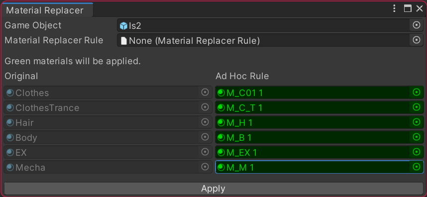
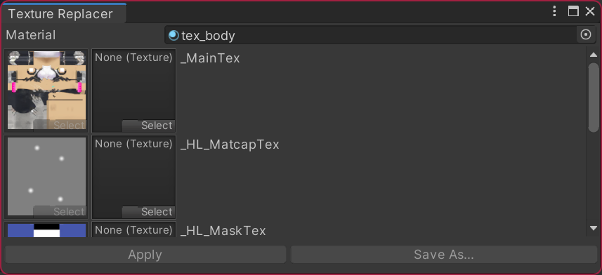

# KRT Material Tools

Small tools to manipulate materials.

[ English | [日本語](./README_JP.md) ]

## Features

All tools are available in `Tools/KRT Material Tools` menu.

### Material Replacer

Tool to replace materials at once by defining replacement rules.

This save the hassle of manually changing materials one by one. It would be useful when applying your own materials to dressed avatars.

#### Material Replacer Rule

Use `Create/KRT Material Tools/Material Replacer Rule` context menu to create a rule asset.

Migration is required when you used [Material Replacer](https://github.com/kurotu/MaterialReplacer) in the project before.
(`Tools/KRT Material Tools/Migrate Legacy Assets` menu)

### Texture Replacer

Tool to replace textures at once by defining replacement rules.

This tool would be useful when a texture is referenced by multiple material properties.
You would not forget to change all of them.

## Demo & Screenshots

[Demo (YouTube)](https://youtu.be/cPbJyPUZaqo)

## Installation

There are two options to import the package into your project.

### [Recommended] VRChat Creator Companion (VCC)

Click [this link](https://kurotu.github.io/vpm-repos/vpm.html) to add a community repository to VCC.
Then add `KRT Material Tools` to your project.

[Material Replacer](https://github.com/kurotu/MaterialReplacer) will be automatically removed when installing KRT Material Tools to your project with VCC.

### Unitypackage

Download the latest .unitypackage from [the release page](https://github.com/kurotu/krt-material-tools/releases/latest) or [Booth](https://booth.pm).

## Verified Environments

- Unity 2019.4.29f1

## Contact

- VRCID: kurotu
- Twitter: [@kurotu](https://twitter.com/kurotu)
- GitHub: [kurotu/krt-material-tools](https://github.com/kurotu/krt-material-tools)
