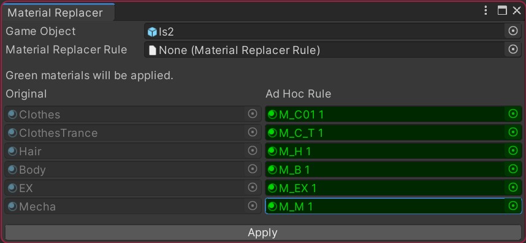
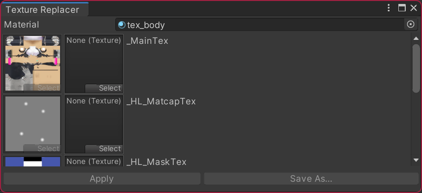

# KRT Material Tools

マテリアルを操作する小さなツール群

[ [English](./README.md) | 日本語 ]

## 機能

すべてのツールは `Tools/KRT Material Tools` メニューから利用できます。

### Material Replacer

ルールを定義して一括でマテリアルを置換するツールです。

マテリアルを一つずつ手動で変更する手間を省くことができます。衣装を着たアバターに自分のマテリアルを適用するときなどに便利です。

#### Material Replacer Rule

`Create/KRT Material Tools/Material Replacer Rule` コンテキストメニューからルールアセットを作成します。

過去にプロジェクト内で [Material Replacer](https://github.com/kurotu/MaterialReplacer) を利用していた場合は移行処理が必要です。
(`Tools/KRT Material Tools/Migrate Legacy Assets` メニュー)

### Texture Replacer

ルールを定義して一括でテクスチャを置換するツールです。

テクスチャがマテリアルの複数プロパティで参照されているときに便利です。すべての参照を忘れずに変更できます。

## デモ & スクリーンショット

[デモ (YouTube)](https://youtu.be/cPbJyPUZaqo)

## インストール

2つの方法があります。

### [推奨] VRChat Creator Companion (VCC)

[このリンク](https://kurotu.github.io/vpm-repos/vpm.html)をクリックして VCC にコミュニティリポジトリを追加します。
その後 `KRT Material Tools` をプロジェクトに追加します。

VCC で KRT Material Tools をプロジェクトに追加すると [Material Replacer](https://github.com/kurotu/MaterialReplacer) は自動的に削除されます。

### Unitypackage

[リリースページ](https://github.com/kurotu/krt-material-tools/releases/latest) または [Booth](https://kurotu.booth.pm) から最新の .unitypackage をダウンロードします。

## 動作確認済み環境
- Unity 2019.4.29f1

## 連絡先

- VRCID: kurotu
- Twitter: [@kurotu](https://twitter.com/kurotu)
- GitHub: [kurotu/krt-material-tools](https://github.com/kurotu/krt-material-tools)
